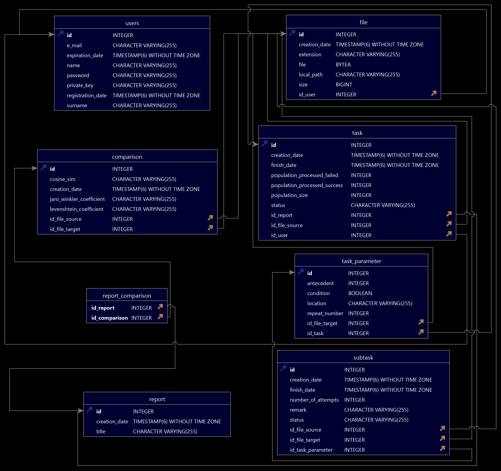

# Plagiarism Detection Application

## Introduction
The Plagiarism Detection Application is designed to identify potential cases of plagiarism in text documents. It supports the most popular document formats and plain text files. The application is implemented with:

- **Backend**: Java with the Spring Boot framework.
- **Database**: PostgreSQL relational database.
- **Frontend**: TypeScript with React JS.
- **Batch Processing**: Python for file comparison.
- **Communication**: REST API.

## Features
- Upload documents for plagiarism analysis.
- Manage documents in the database.
- Generate and download reports.
- User registration and authentication.

## Architecture
The application is built on a modular architecture where:

- **Backend** handles document processing and database interactions.
- **Frontend** provides a user interface.
- **Custom message queue** coordinates file processing tasks.

---

## API Endpoints
### Document Operations
- **`/api/task`**: Order a document check task.
  - **Method**: POST
  - **Content-Type**: multipart/form-data
  - **Body**: `userEmail`, `fileSource`
  - **Response**: Status message

- **`/api/file/db-upload`**: Upload a file to the database.
  - **Method**: POST
  - **Content-Type**: multipart/form-data
  - **Body**: `file`
  - **Response**: Status message

- **`/api/file`**: Delete a file from the database.
  - **Method**: DELETE
  - **Content-Type**: application/json
  - **Body**: `id`
  - **Response**: Status message

- **`/api/file/find-all-by-email`**: Retrieve all files for a specific email.
  - **Method**: POST
  - **Content-Type**: application/json
  - **Body**: `email`
  - **Response**: List of files and status message

- **`/api/report`**: Download reports.
  - **Method**: GET
  - **Content-Type**: application/json
  - **Body**: -
  - **Response**: List of reports and status

### Database Operations
- **`/api/db-test`**: Retrieve all entries in the Test table.
  - **Method**: GET
  - **Content-Type**: application/json
  - **Response**: All entries in the Test table

- **`/api/db-test`**: Create a new Test table entry.
  - **Method**: POST
  - **Content-Type**: application/json
  - **Body**: `idTest`, `name`, `subName`
  - **Response**: Status message

- **`/api/db-test/find-by-id/{id}`**: Find a Test table entry by ID.
  - **Method**: GET
  - **Content-Type**: application/json
  - **Body**: `id`
  - **Response**: Entry content and status

- **`/api/db-test/find-by-id-name`**: Find a Test table entry by ID and name.
  - **Method**: GET
  - **Content-Type**: application/json
  - **Body**: `id`, `name`
  - **Response**: Entry content and status

### User Management
- **`/api/security/register`**: User registration.
  - **Method**: POST
  - **Content-Type**: application/json
  - **Body**: User details (`name`, `surname`, `email`, `password`)
  - **Response**: Status message

- **`/api/db-test/authenticate`**: User authentication.
  - **Method**: POST
  - **Content-Type**: application/json
  - **Body**: User details (`name`, `surname`, `email`, `password`)
  - **Response**: Status message

---
### API Class Diagram

---

## Custom Message Queue
The process of comparing the contents of files is carried out under the control of a queue of its own implementation. The designed queue works as follows:
1) The file sent for checking is added to the database. This calls a method that creates a new entry in the `task` table with a `TODO` execution status.
2) Using the task scheduling mechanism built into Spring, we call a method that finds a previously created task table entry with a `TODO` status in the database. Then, based on the information about the file under consideration, entries are created in the `task_parameter` table: the previous process is indicated if the order of calling subprocesses matters, the number of possible repetitions of the execution of the batch process in case of its failure is specified, the execution conditions of the process, if any, are set, the assignment to a specific task (`task`) and the file with which the comparison will be made.
3) A method is executed that, based on data from the `task_parameter` table, creates subtasks populating the `subtask` table: the reference to the associated parameter from the `task_parameter` table is stored, the status is set to `TODO`, both files used and processed further in the process by algorithms are assigned.
4) If the subtasks and their parameters have been correctly stored in the database, the application will again, with the help of the built-in task scheduling mechanism, call a method that will check whether there are pending subtasks (in `TODO` status) in the database, collect them and proceed to execute them in a batch process.
5) Due to the cyclic operation of the subtask executing method, it is possible both to execute subtasks with `TODO` status and to repeat the call of subtasks with `FAILED` status specified in the application parameters a number of times. The method executing subtasks each time collects entries with the above-mentioned statuses, checks the possibility of re-executing them and performs a decrement of the execution counter for each of them immediately after execution.

---

## Text Comparison Algorithms
The processing is by default performed with Python scripts managed by the batch jobs, but alternatively, it can also utilize corresponding Java implementation if needed.
### 1. Levenshtein Distance
Levenshtein Distance measures the number of single-character edits (insertions, deletions, or substitutions) needed to transform one string into another. Lower distances indicate higher similarity.

### 2. Jaro-Winkler Similarity
Jaro-Winkler is a similarity metric that accounts for the number of matching characters and the order of characters. It is particularly effective for short strings or when minor typos occur.

### 3. Cosine Similarity
Cosine Similarity calculates the cosine of the angle between two vectors in a multi-dimensional space, often used for comparing text by converting it into a vector space model (e.g., TF-IDF).

---
## Business Class Diagram

---
## Database Schema

---

## Building and running
Before building and running the main project's application, it is also necessary to properly edit and adjust the properties in the 'application.properties' configuration file. Properties that need to be verified and adjusted:
- `spring.datasource.username` – database server username,
- `spring.datasource.password` – database user password,
- `db.ip` – database server address,
- `db.name` – database name,
- `app.schedule.job-provider` – parameter defining the interval at which the module preparing subtasks in the message queue should be called,
- `app.schedule.job-executor` – parameter defining the intervals at which subtasks in the message queue are to be executed,
- `app.python.binary` – path to Python executable (for example for Windows: C:/Users/User/AppData/Local/Programs/Python/Python310/python.exe)
- `app.python.script.levenshtein` – path to the script that processes text and calculates the Levenshtein distance for compared documents
- `app.python.script.jarowinkler` – path to the script that processes text and calculates the Jaro-Winkler distance for the compared documents
- `app.python.script.cosine` – path to the script that processes text and calculates cosine similarity for compared documents
- `app.schedule.subtask-repeats` – parameter defining the number of attempts to re-execute the subtask that should be made in case of failure
